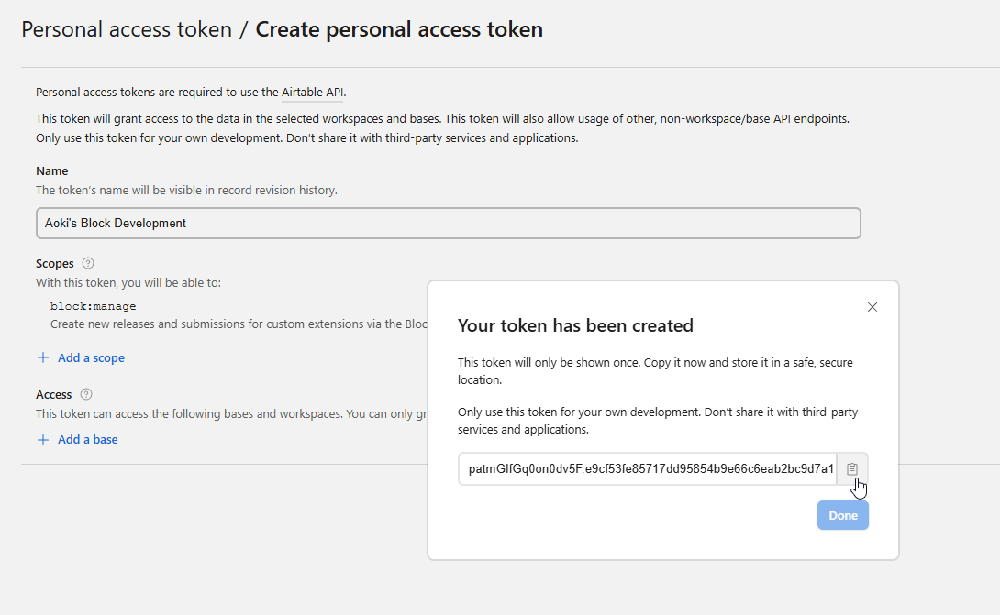
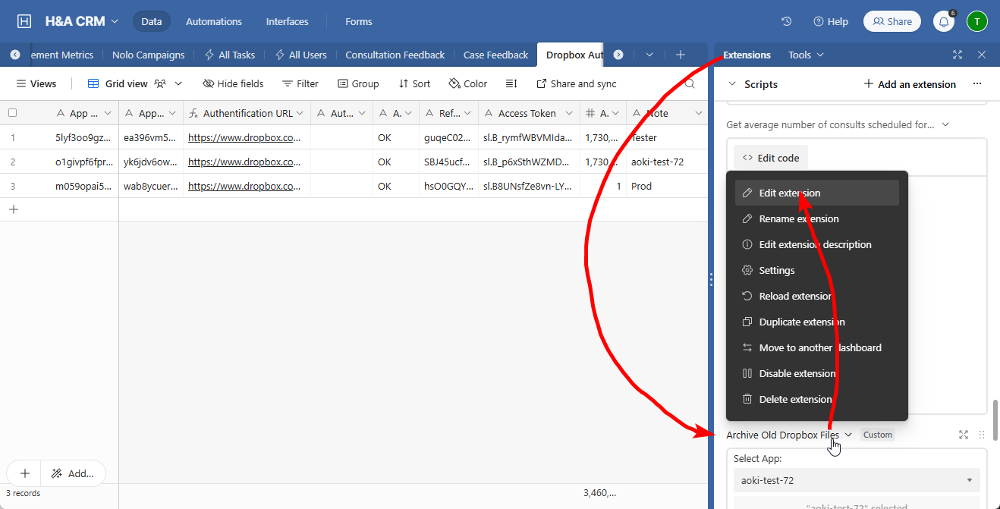
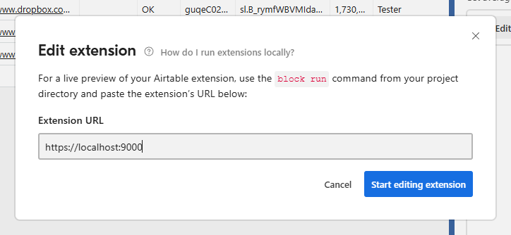

# Installation

Clone repo:
```bash
git clone git@github.com:eweldon/hl_dropbox_auto_archiver.git
```

Install dependencies:
```bash
npm i --legacy-peer-deps
```

# Developing

In order to develop the app and/or deploy it to the Airtable we need `@airtable/blocks-cli` package and a personal access token with `block:manage` scope enabled.

The `blocks-cli` can be either used locally in your repo since it's listed as a dev dependency by prefixing `block ...` commands with `npx` (e.g. `npx block run`) or installed globally on your machine by running `npm i -g @airtable/blocks-cli` and available without the usage of `npx`.

Airtable PAT can be obtained at https://airtable.com/create/tokens.


Now go back to the local repo's console and run:
```bash
block set-api-key <token>
```

Launch compiler by running:
```bash
npm start
```

Wait for it to launch. When it launches a link to the localhost will be automatically copied to your clipboard. Now go to the Airtable and open `Extensions` tab, find this extension, click on it's name and select `Edit extension`: 

After this you'll be prompted to enter extension URL: 
Insert the localhost URL that compiler copied to your clipboard started. If you're using localhost you'll likely be asked by Airtable to permit access to localhost somewhere in your browser settings and present with instructions on how to do it.

Now compiler should automatically build app from your machine whenever you make changes to files and display it on the airtable.

# Deploying

Considering you did all the previous steps you should already have everything set up. All you have to do is just run:
```bash
npm run deploy
```
